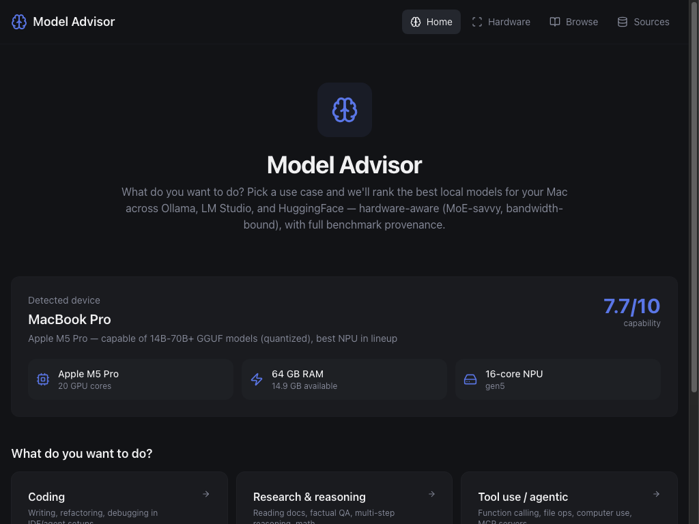
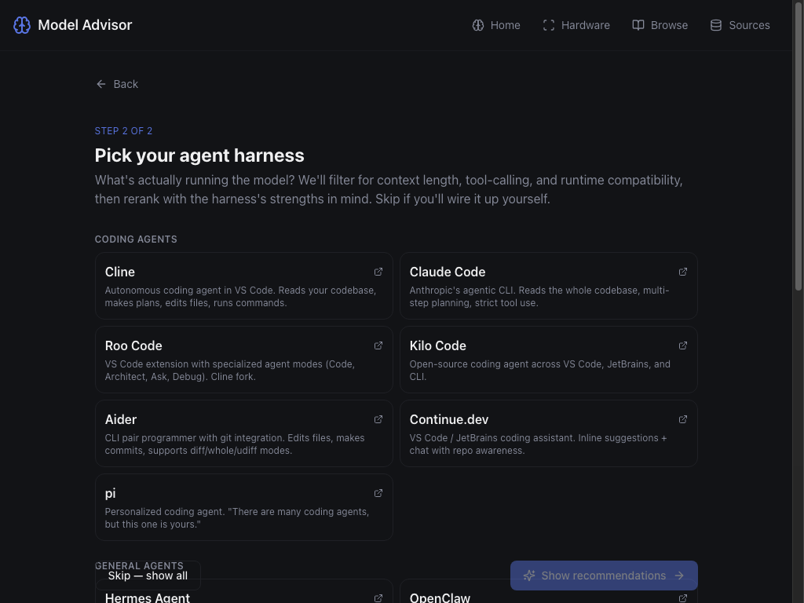
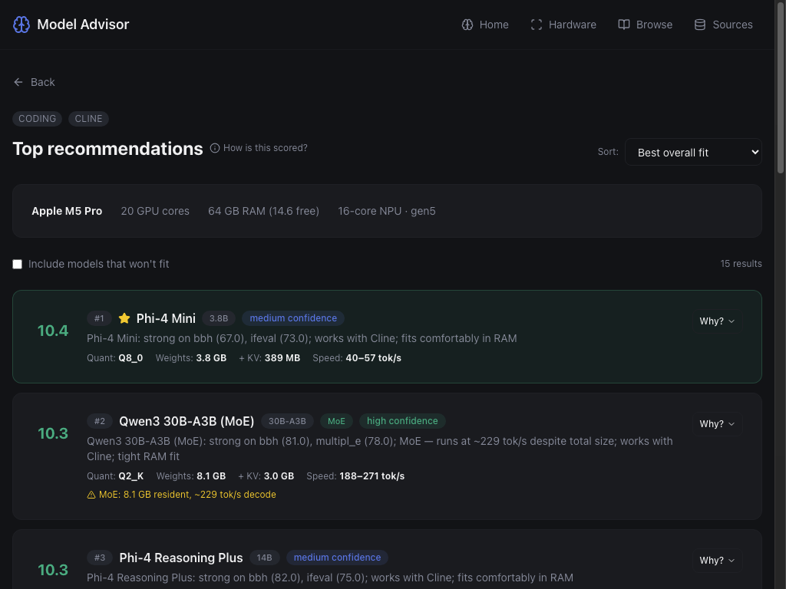
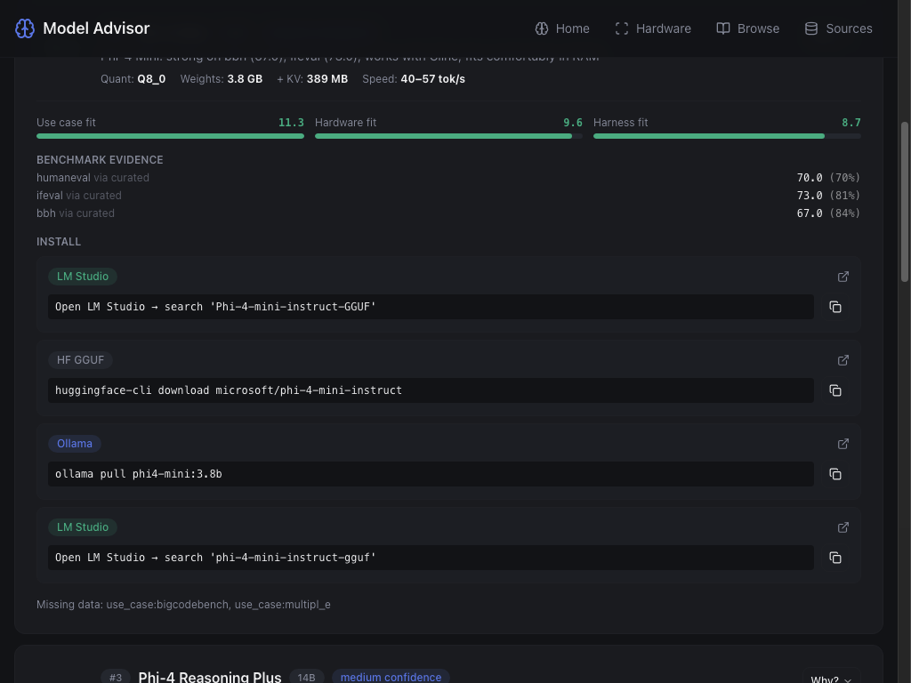
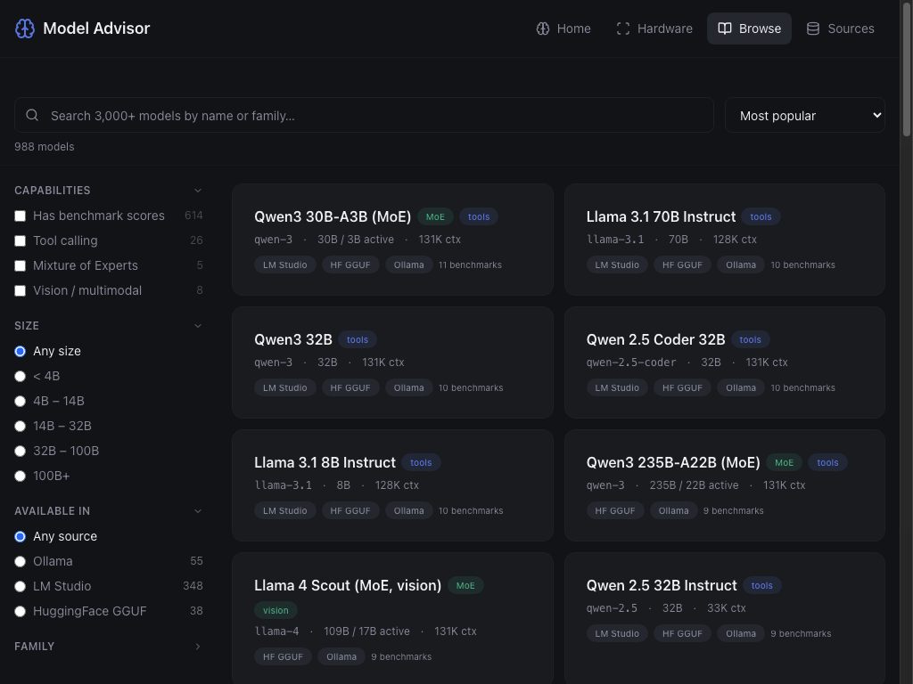
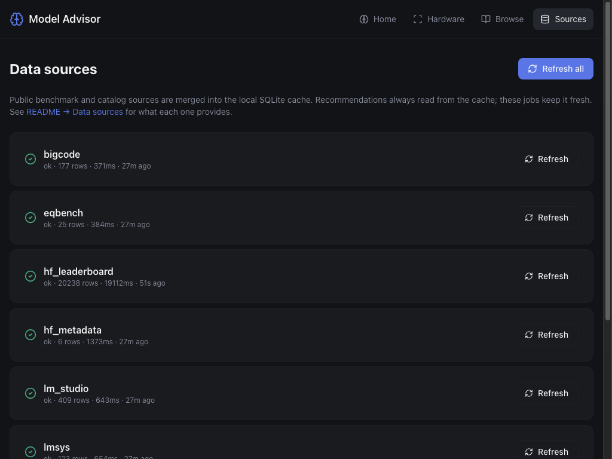

# Model Advisor

**Local AI model advisor for Apple Silicon Macs.** Scans your hardware, joins seven
public model-evaluation sources into a local SQLite catalog, and ranks the best
local LLMs for what you actually want to do — coding, research, agentic tool use,
chat, creative writing, or vision — for the agent harness you're using (Cline,
Claude Code, Aider, Continue, LM Studio, raw Ollama, …).

Recommendations are physics-grounded: memory bandwidth-bound decode TPS,
KV-cache budgeting, and proper MoE handling (so a 30B/3B-active MoE like
**Qwen3-30B-A3B** ranks where it should — at 3B-model speed, not 30B-model speed).

Every score traces back to the benchmark and source that produced each number.
Click "Why?" on any row to see the breakdown.

## Status

Working alpha. Tested daily on M3 Max / M5 Pro hardware. Catalog has ~3,200 models,
~2,900 of which have parsed parameter counts and at least partial benchmark coverage.
~32 are hand-curated for highest-confidence rankings — including 2025 frontier
open-weights like Qwen3 (incl. 30B-A3B and 235B-A22B MoE), Llama 4 Scout,
DeepSeek R1 family, Gemma 3, Phi-4, and **gpt-oss** (20B and 120B MoE).

## Screenshots

|  |  |
|---|---|
| **Home** — auto-scan, capability score, use-case picker | **Wizard** — pick the agent harness you'll run the model in |
|  |  |
| **Top recommendations** — physics-grounded, MoE-aware | **"Why?"** — full provenance + copy-paste install commands |
|  |  |
| **Browse** — filter 3,000+ models with live facet counts | **Sources** — every benchmark feed, with last-run status |
|  |  |

## Requirements

- **macOS** (Apple Silicon recommended) — required for hardware scan
- **Python 3.11+**
- **Node.js 18+**

## Quick start

```bash
git clone https://github.com/ethanphan3993/Model-Advisor.git
cd Model-Advisor

# Install
python3 -m venv .venv
.venv/bin/pip install -r backend/requirements.txt
(cd frontend && npm install)

# One-time: populate the local data cache (~90s for all sources — HF leaderboard
# pages are paced at 250ms each to stay under the public rate limit)
make refresh

# Run — pick one
make dev          # Backend :8000 + frontend :5173 (hot reload, dev)
make package run  # Single-port server :8000 (production-style)
```

Open `http://localhost:5173` (dev) or `http://localhost:8000` (packaged).

`make dev` will prompt whether to wipe-and-refresh data first; press Enter to skip.

## How it works

```
┌────────────────────────────────────────────────────────────────┐
│  Hardware scan       7 public data sources                      │
│  (system_profiler,   Ollama · HF metadata · HF Open LLM         │
│  vm_stat, sysctl)    BigCode · LMSYS · EQ-Bench · LM Studio     │
│         │                          │                            │
│         ▼                          ▼                            │
│   chip + RAM +              SQLite catalog (.cache/)            │
│   storage + GPU             models + scores + artifacts         │
│         │                          │                            │
│         └──────────┬───────────────┘                            │
│                    ▼                                            │
│         Recommender (3-axis)                                    │
│         0.55 · use-case score (benchmark match)                 │
│         0.30 · hardware fit  (RAM + bandwidth-bound TPS)        │
│         0.15 · harness fit   (Cline, Aider, etc.)               │
│                    │                                            │
│                    ▼                                            │
│         Ranked recommendations + provenance                     │
└────────────────────────────────────────────────────────────────┘
```

### Scoring

```
fit_score = 0.55 × use_case_score   (benchmark match for the task)
          + 0.30 × hardware_fit      (RAM fit + decode speed)
          + 0.15 × harness_fit       (compatibility with chosen agent)
```

Sub-scores are 0–10. Use-case score can exceed 10 when the chosen harness boosts
the task (e.g. Cline boosts coding × 1.5), so total fit reads up to ~12 for an
ideal match. Click "How is this scored?" in the UI for the full explainer.

### Hardware model

Decode TPS is bound by memory bandwidth, not GPU cores:

```
TPS ≈ bandwidth_GB_s / active_params_GB × 0.70
```

For dense models, `active_params == total_params`. For MoE models like
Qwen3-30B-A3B, only the active 3B is read per token, so decode is ~10× faster
than a same-total-size dense model. Hardware fit accounts for both:
weights + KV cache must fit in RAM (uses *total*), but speed scales with
*active*.

Apple Silicon bandwidths used (GB/s):

| Chip      | M1 | M1 Pro | M1 Max | M1 Ultra | M2/M3 base | M3 Pro | M3 Max | M4 | M4 Pro | M4 Max |
|-----------|----|----|----|----|----|----|----|----|----|----|
| Bandwidth | 68 | 200 | 400 | 800 | 100 | 150 | 400 | 120 | 273 | 546 |

## Data sources

| Source | Provides | Status |
|---|---|---|
| **Ollama** | Install artifacts, sizes, quantization tags | Live |
| **HF model metadata** | Real GGUF sizes, context length, capabilities, license | Live (gated models return 401) |
| **HF Open LLM Leaderboard** | IFEval, BBH, MMLU-PRO, GPQA, MUSR, MATH | Live (~3,000 models) |
| **BigCode Models Leaderboard** | HumanEval, MultiPL-E, BigCodeBench | Live |
| **LMSYS Arena** | MT-bench, MMLU | Live (Arena ELO needs pickle parsing — TODO) |
| **EQ-Bench v3** | Composite creative-writing score | Live |
| **LM Studio** | Curated GGUFs from `lmstudio-community` HF org | Live |
| **Artificial Analysis** | Quality cross-validation | Optional, requires API key (`MODEL_ADVISOR_AA_API_KEY`) |

## Limitations / honest caveats

- **macOS only** for hardware scan. The recommender works without a scan if you
  hardcode hardware specs (improvement: manual specs entry — see issues).
- **Curated benchmarks for ~32 models** (in `backend/data/benchmarks.yaml`).
  The other ~3,200 in the catalog get whatever the leaderboards measure — coverage
  is partial for any single model. The Results page surfaces this with a numeric
  `XX% confidence` chip and lists the missing benchmarks.
- **Some sources scrape public sites** (BigCode CSV, EQ-Bench JS) and could break
  if those layouts change. The Sources page surfaces failures honestly.
- **HuggingFace gated models** (Llama, Gemma) return 401 to anonymous metadata
  fetches. Set `HF_TOKEN` to enrich them. (TODO: wire this up.)
- **No telemetry.** Outbound traffic is to public dataset APIs only.

## Layout

```
backend/
├── main.py               FastAPI app + frontend static mount
├── db.py                 SQLite schema + helpers
├── data/                 Curated YAMLs (aliases, benchmarks, harnesses, use_cases)
├── routers/              scan, models, recommend, refresh, meta
├── services/
│   ├── hardware.py       macOS scanner (system_profiler / vm_stat / sysctl)
│   ├── identity.py       Cross-source canonical id resolution + heuristics
│   ├── recommender.py    3-axis scoring engine, MoE-aware, bandwidth-bound TPS
│   ├── data_loader.py    YAML loaders
│   ├── refresh.py        Source orchestrator
│   └── sources/          Seven fetchers (one per data source)
└── tests/                pytest

frontend/src/
├── App.tsx               Router + nav
├── pages/                Home · Wizard · Results · ModelDetail · Compare ·
│                         Browse · ScanResults · Sources
├── components/           ScoreBar, InstallCommand, ProvenanceBadge
└── hooks/                useScan, useMeta, useRecommend
```

## API

| Method | Path | Purpose |
|---|---|---|
| GET  | `/api/health` | Health check |
| GET  | `/api/scan` | Hardware scan + AI capability score |
| GET  | `/api/use-cases` | List use cases |
| GET  | `/api/harnesses` | List agent harnesses |
| GET  | `/api/models?…` | Browse catalog (q/family/source/sort/has_benchmarks/min_params/max_params/…) |
| GET  | `/api/models/{canonical_id}` | Full detail with all scores + artifacts |
| POST | `/api/recommend` | Body: `{use_case, harness?, limit, include_too_big}` |
| POST | `/api/refresh?source=` | Refresh one or all sources |
| GET  | `/api/sources` | Status of all data sources |

## Development

```bash
make test       # pytest (20 tests)
make refresh    # re-fetch all data sources
make stop       # stop dev servers
make clean      # wipe venv, node_modules, dist, static, cache
```

See [CONTRIBUTING.md](CONTRIBUTING.md) for how to add a model, harness, or data
source.

## Performance

- **Recommender response cache**: keyed on `(catalog version, hardware, query)`,
  auto-invalidates when any source refreshes. 5-min TTL, 200-entry LRU.
  Cold call ~70 ms, warm hit ~0.3 ms (~250× speedup) — clicking around the
  wizard with the same hardware feels instant.
- **Hardware snapshot cached for 15s** at the API router: avoids re-running
  `system_profiler` (~1.3s of subprocess overhead) on every recommend call.
- **Polite HF leaderboard fetching**: 250ms per page, exponential backoff on
  5xx, honors `Retry-After` on 429.

## Roadmap

- [ ] HF token support for gated models (Llama, Gemma metadata)
- [ ] Manual hardware-specs entry (works on Linux/Windows for browse + recs)
- [ ] LMSYS Arena ELO via pickle parsing
- [ ] Plugin interface for community-contributed sources
- [ ] More 2025 models (Granite 4, Aya 32B, Falcon 3, …)
- [ ] Pip-installable distribution
- [ ] Multi-model bundle recommender ("3 models that together cover coding+chat
  +vision under N GB total") — a real knapsack DP problem
- [ ] **Image generation track** — recommend local diffusion models (FLUX,
  Stable Diffusion 3.5, SDXL, AuraFlow, …) for Mac apps like Drawthings,
  Mochi Diffusion, ComfyUI. Different domain (compute-bound, safetensors not
  GGUF, no unified leaderboard) — needs its own pipeline.
  See [#16](https://github.com/ethanphan3993/Model-Advisor/issues/16).

## License

[MIT](LICENSE)
